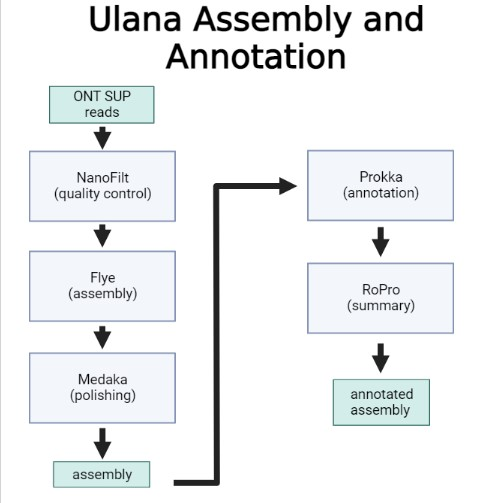

# Ulana
***U***nicellular ***L***ong-read ***A***ssembly a***N***d ***A***nnotation

A bacterial genome assembly and annotation using SUP ONT basecalled data from MinION and Flongle flow cells.

ulana

1. vt. To plait, weave, knit, braid; plaiting, weaving. Also unala, nala, unana. Mea ulana ʻia, plaited or woven material, textile. Mea ulana lole, weaver (Isa. 38.12), loom. (PPN langa.)

```
 _   _ _
| | | | | __ _ _ __   __ _
| | | | |/ _` | '_ \ / _` |
| |_| | | (_| | | | | (_| |
 \___/|_|\__,_|_| |_|\__,_|


Ulana v1.0.0

Bacterial genome assembly and annotation
using SUP ONT basecalled data
for MinION and Flongle flow cells

Usage: /usr/bin/ulana
  -h    help (prints this message)
  -v    version
  -q    minimum quality score; default is 10
  -l    minimum read length; default is 1000
  -c    number of cores to use; default is 4
  -i    name of input fastq file containing reads
```

# Installation

Docker image to run this pipeline as a container:
```
docker pull ethill/ulana:latest
docker exec -it container_name bash
```

# Sample command
```
# Fast
ulana -q 8 -l 1500 -c 56 -i my_sup_reads.fastq
# HAC
ulana -q 9 -l 1500 -c 56 -i my_sup_reads.fastq
# SUP
ulana -q 12 -l 1500 -c 56 -i my_sup_reads.fastq
```

# Workflow illustration


